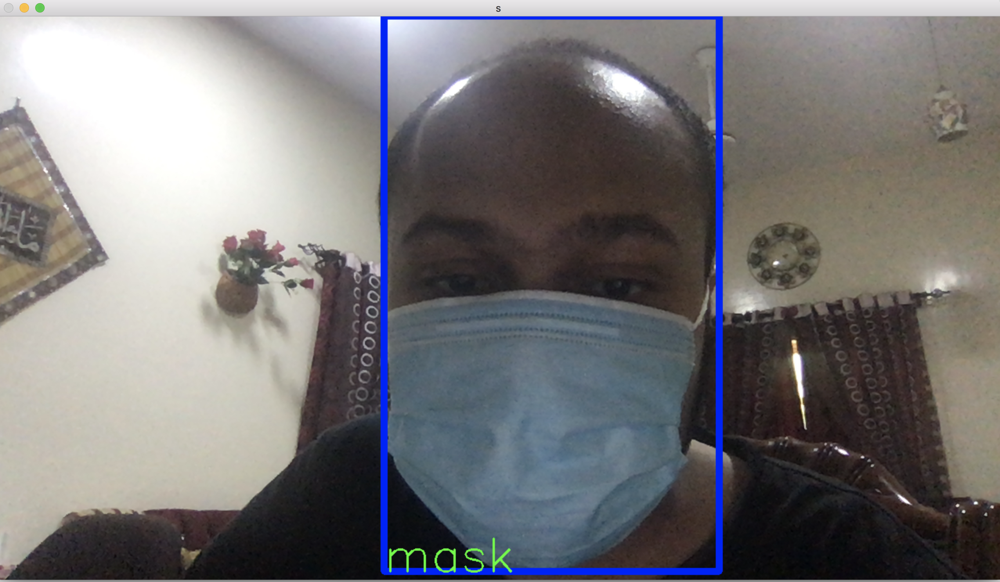

# object-detection-node
This is an example on how we can use ***@cloud-annotations*** in Nodejs.

You can find an in depth walkthrough for training a TensorFlow.js model [here](https://github.com/cloud-annotations/training/).

## Setup
`git clone` the repo and `cd` into it by running the following command:

```bash
git clone https://github.com/cloud-annotations/object-detection-node.git
cd object-detection-node
```

### `npm install`

> **Note: You’ll need to have Node 8.10.0 or later on your local development machine.** You can use [nvm](https://github.com/creationix/nvm#installation) (macOS/Linux) or [nvm-windows](https://github.com/coreybutler/nvm-windows#node-version-manager-nvm-for-windows) to easily switch Node versions between different projects.

## Add TensorFlow.js Model to the App
Copy the `model_web` directory generated from the object detection walkthrough and paste it into the root directory of this repo.

## Run the App
### `npm start`

It will open a window and show live stream of processed images through @cloud-annotations/models-node

